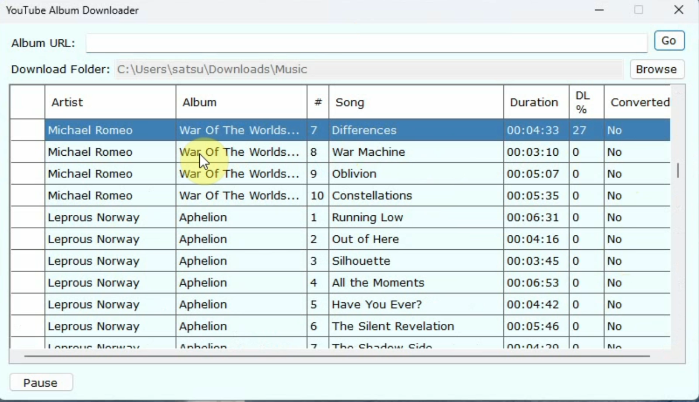

# YouTube Album Downloader (YTAD)

The software seamlessly downloads full albums from any YouTube Music playlist in the highest available MP3 format.

Simply copy and paste the playlist link from YouTube Music into YTAD. With one click, it finds the best audio sources from the related YouTube video and stitches together the full album. YTAD grabs the highest bitrate audio available for premium sound quality. It's perfect for use with [Plex Music](https://www.plex.tv/plexamp/). 

## Tutorial

https://github.com/rkrehn/YTAD/assets/15220483/dfc5bed5-adf6-4b77-bbc7-1c9f1de0f53a

If you're unable to watch the video, the steps are below:

1. Open a browser and go to [https://music.youtube.com](https://music.youtube.com)
2. Find an artist and album you like
3. Copy the URL
4. Paste the URL in YouTube Album Downloader at the top
5. Click "Go"

Music will begin downloading automatically into the specified folder. Subdirectories will include one subdirectory for each artist, then a subdirectory for each album, and finally, the mp3s will be listed by track number and song name.

## Prerequisites

1. Must have [ffmpeg](https://ffmpeg.org/). The exe file should be in C:\Windows\System32
2. Must have Windows 7 or later
3. [Download this file](https://github.com/rkrehn/YTAD/releases/tag/main)
4. Must have an empty folder dedicated for only music

## Screenshot

## Legal Disclaimer

All music files downloaded through this software must be legally owned and purchased by the user. By downloading music via this software, you represent that you have purchased and fully own the rights to any downloaded content or an active subscription to YouTube Music. Downloading or distributing pirated or illegal music copies is strictly prohibited. I claim no ownership rights to any downloaded music files - all such rights remain with the content owner. I accept no liability for the illegal use of any files downloaded through this software. Please contact me if you have any questions about the legal use of downloaded music.

## Download

[Download This File](https://github.com/rkrehn/YTAD/releases) | [Donate](https://www.paypal.com/donate/?hosted_button_id=E67KQM3NRZE6W)
